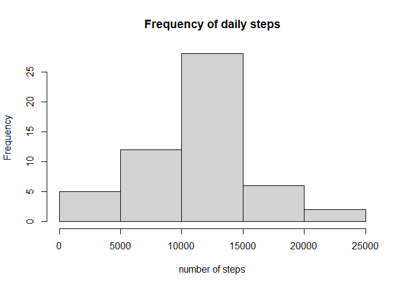
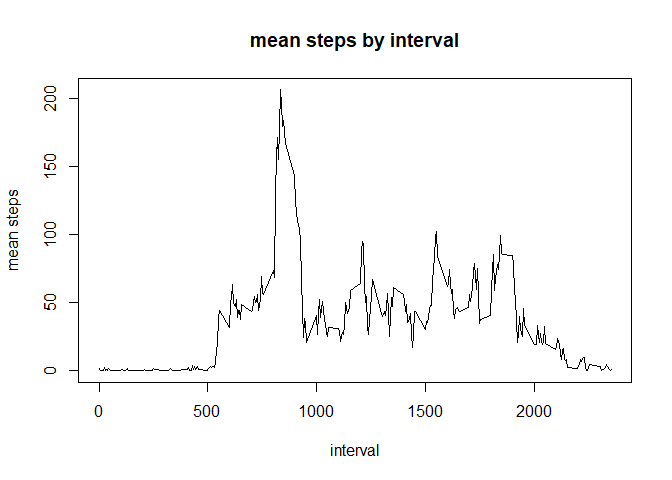
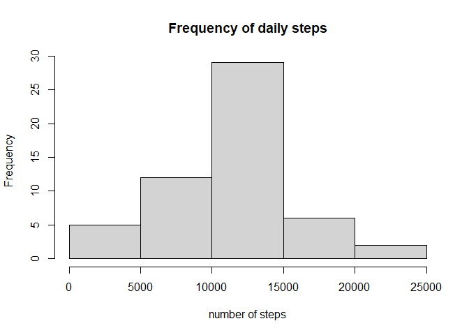
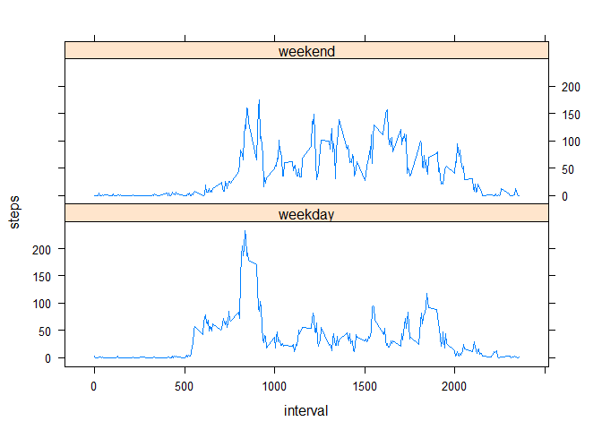

```r
knitr::opts_chunk$set(echo=TRUE)
```


## Loading and preprocessing the data
First unzip the file and load the resulting CSV as dataframe df. 
 echo = TRUE


```r
unzip("./activity.zip")
df<- read.csv("./activity.csv")
```

we will then aggregate number of steps by day, x:

```r
df_daily<- aggregate(df$steps, FUN="sum", by=list(df$date))
```

## What is mean total number of steps taken per day?
Let's visualise the number of steps per day and calculate the mean and median:

```r
hist(df_daily$x, xlab="number of steps", main="Frequency of daily steps")
```

<!-- -->

```r
daily_mean <- as.integer(mean(df_daily$x, na.rm=TRUE))
daily_median <- as.integer(median(df_daily$x, na.rm=TRUE))
```
The mean is 10766 and the median is 10765. 


## What is the average daily activity pattern?
Use library dplyr and then summarise the mean grouped by interval in a new dataframe df_interval.
Let's then calculate max interval and plot mean activity over the course of a day. 

```r
library(dplyr)
```

```
## 
## Attaching package: 'dplyr'
```

```
## The following objects are masked from 'package:stats':
## 
##     filter, lag
```

```
## The following objects are masked from 'package:base':
## 
##     intersect, setdiff, setequal, union
```

```r
df_interval<- df %>% group_by(interval) %>% summarize(mean(steps, na.rm=TRUE))
colnames(df_interval)[2]<- "Mean steps"
max_interval<- df_interval[(which.max(df_interval$`Mean steps`)),1]
plot(df_interval$interval, df_interval$`Mean steps`, type="l", ylab="mean steps", xlab="interval", main="mean steps by interval")
```

<!-- -->

The interval of maximum activity is 835.


## Imputing missing values
How many rows have missing values?

```r
missing_values= is.na(df$steps)
no_of_missing_values<- sum(missing_values)
percent_missing_values<-(sum(missing_values)*100)/length(missing_values)
```
So we can see 2304 rows have missing data which is 13.1147541% of rows. 
Let's replace all missing values from with the corresponding mean for that interval instead. 

```r
df2<-df
na_positions <- is.na(df2$steps)
n=1
for (i in na_positions) {
  replace_mean= as.numeric(df_interval[n,2])
  if (i==TRUE) {
    replace_mean= as.numeric(df_interval[n,2])
    df2$steps[n]= replace_mean }
  n=n+1
}
```
Let's aggregate that again:

```r
df_daily2<- aggregate(df2$steps, FUN="sum", by=list(df2$date))
```

## What is mean total number of steps taken per day after replacing NAs?
Again, Let's visualise the number of steps per day and calculate the mean and median:

```r
hist(df_daily2$x, xlab="number of steps", main="Frequency of daily steps")
```

<!-- -->

```r
daily_mean <- as.integer(mean(df_daily2$x, na.rm=TRUE))
daily_median <- as.integer(median(df_daily2$x, na.rm=TRUE))
```
The mean is 10766 and the median is 10765. 
Replacing data in this way does not alter the mean and median. 

## Are there differences in activity patterns between weekdays and weekends?
Let's create a factor variable in our new dataset to state whether this is a weekday or weekend.

```r
df2$weekdays <- 
  as.factor(
    ifelse( weekdays(as.Date(df2$date)) %in% c("Saturday", "Sunday"),
           "weekend", "weekday"))
```
We now aggregate the mean for each interval for our two factors 'weekend' and weekday

```r
df2_interval <- aggregate(steps~interval + weekdays, FUN=mean, data=df2)
```
Now let's make a panel plot to show the two series. 

```r
library(lattice)

xyplot(steps~interval|weekdays, data=df2_interval, layout= c(1,2), type="l")
```

<!-- -->

We can see clear differences between weekends and weekdays. For example, the peak previously seen at 835 is much smaller and less noticeable. This could indicate that this is when the person is traveling to work. 
